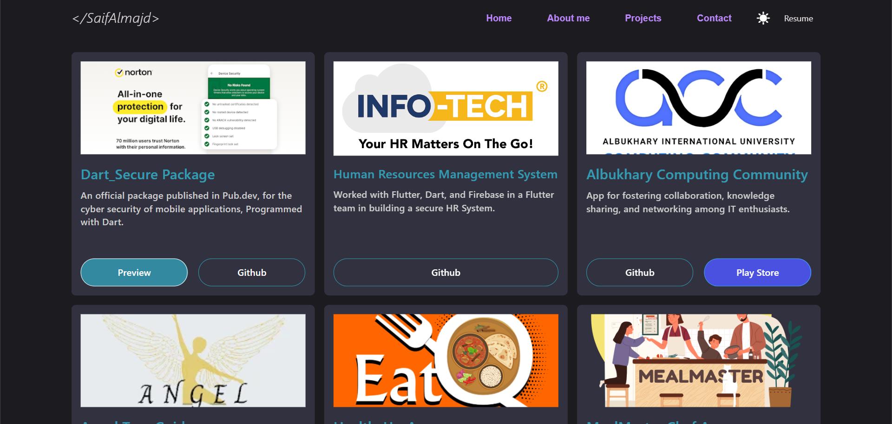

# Portfolio: Flutter Web Portfolio

This is a stunning Flutter Web portfolio, meticulously crafted based on a Figma design and elegantly hosted on Firebase.

## 🌐 Demo URL
Explore the live portfolio: [https://saifalmajd.web.app/](https://saifalmajd.web.app/)

## 📺 Youtube Preview
Watch a sneak peek of the portfolio in action: [YouTube Preview](https://youtu.be/_llGOcJvPzA)

## 💻 Requirements
To tinker with this project, you'll need the following:
- Any Operating System (MacOS, Linux, Windows)
- An Integrated Development Environment (IDE) with Flutter SDK installed (Android Studio, VSCode, etc.)
- A basic understanding of Dart and Flutter.

## 👨‍💻 How to Run
Here's how to get the portfolio up and running:
1. Clone the repository: [GitHub Repository](https://github.com/radyhaggag/web_portfolio_with_flutter.git)
2. Run the project in your browser using the command:
   ```
   flutter run -d chrome --web-renderer html
   ```

## 📷 Screenshots
Take a glimpse of the portfolio through these captivating screenshots:

- Home
  

- About
  

- Projects 
  

- Contact
  

## 📱 Mobile Home Screenshot
Here's a peek at the mobile version of the home page:


Explore the world of this web portfolio designed with Flutter, and showcase your skills in style!