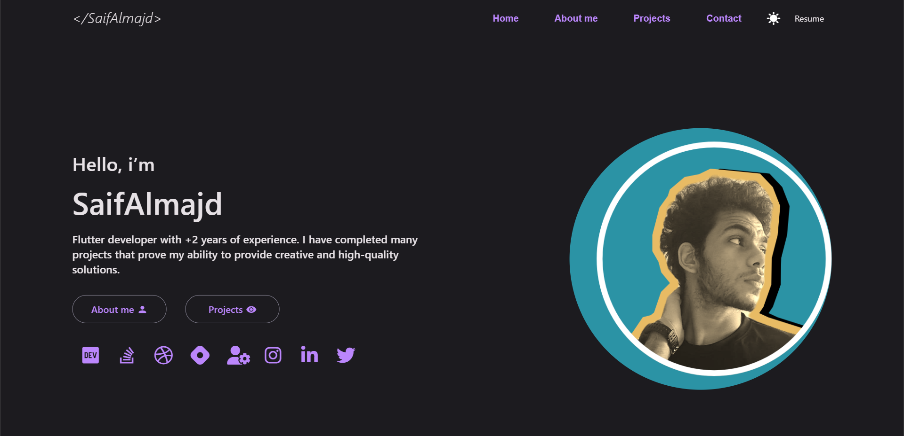
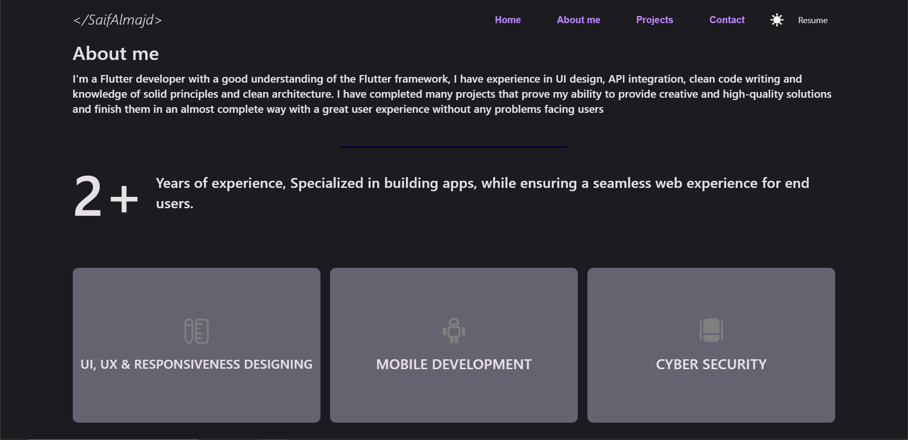
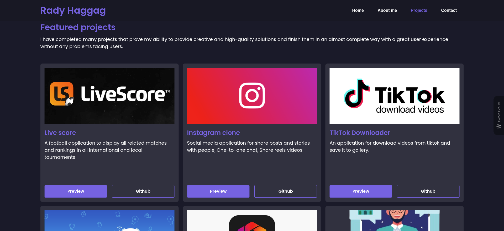
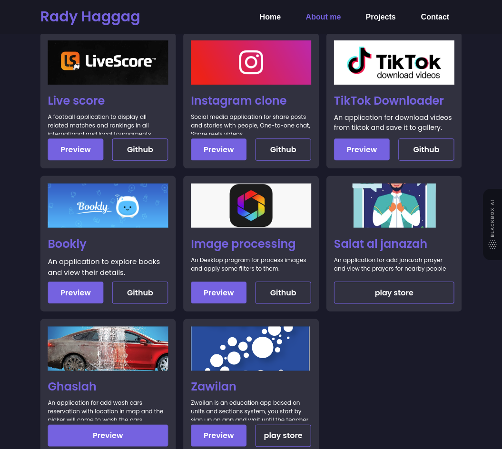
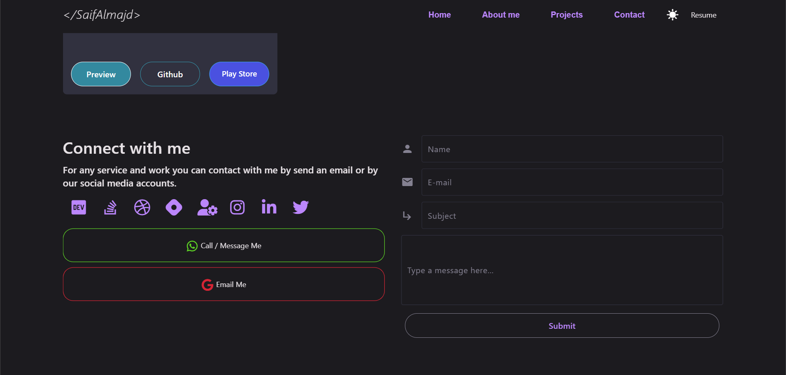
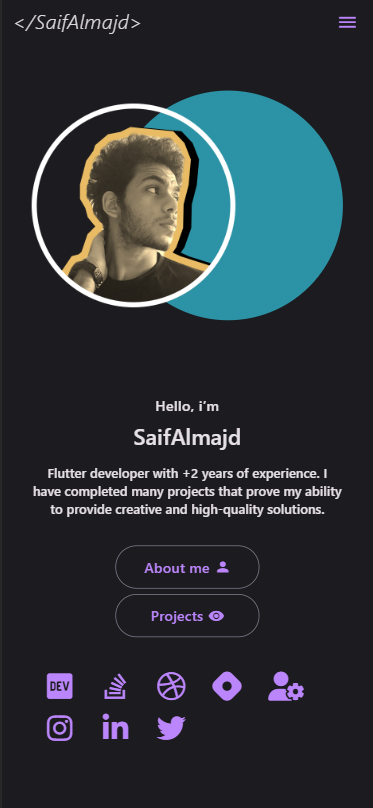

# portfolio

Flutter Web Portfolio, Based on a design on Figma and hosted on Github host.

### Demo URL

https://radyhaggag.github.io/MyPortfolio

### Youtube preview

https://youtu.be/_llGOcJvPzA

### 💻 Requirements

- Any Operating System (MacOS, Linux, Windows)
- Any IDE with Flutter SDK installed (Android Studio, VSCode etc)
- A little knowledge of Dart and Flutter.

### 👨‍💻 How to run

> https://github.com/radyhaggag/web_portfolio_with_flutter.git
> flutter run -d chrome --web-renderer html

### Screenshots

### Mobile home Screenshot

